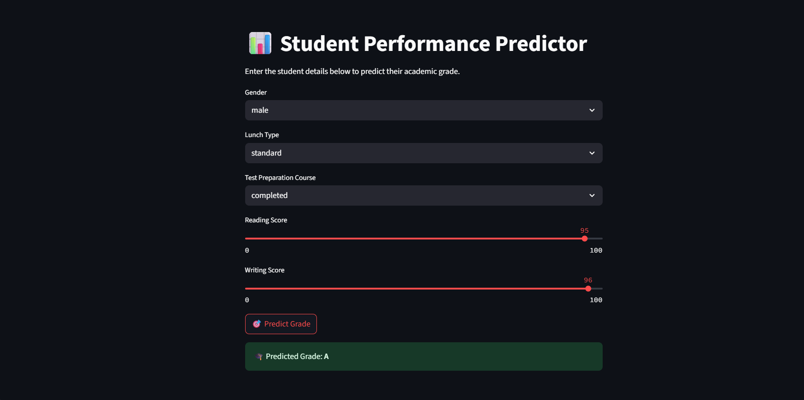

# 🎓 Student Performance Predictor

A machine learning-powered web app that predicts a student’s academic grade based on factors like gender, lunch type, test preparation, and subject scores.

---

## About the Project

This app helps in predicting student performance using a trained ML model. It takes simple inputs like writing score, reading score, gender, lunch type, and test preparation course status, and predicts the student’s **final grade** using a Support Vector Classifier (SVC).

---
## 📸 App Preview



## Features

- Predicts academic grade using minimal input features
- Streamlit-based clean and interactive interface
- Accuracy of **84.5%**
- Uses preprocessing, label encoding, and joblib-based model storage

---

## Tech Stack

- Python
- Pandas, NumPy
- Scikit-learn
- Streamlit
- joblib

---

## ⚙️ How to Run the App

```bash
# Step 1: Clone the repo
git clone https://github.com/KanishkaShivhare20/Student_Performance_Predictor.git
cd Student_Performance_Predictor

# Step 2: Install dependencies
pip install -r requirements.txt

# Step 3: Run the Streamlit app
streamlit run app/streamlit_app.py


